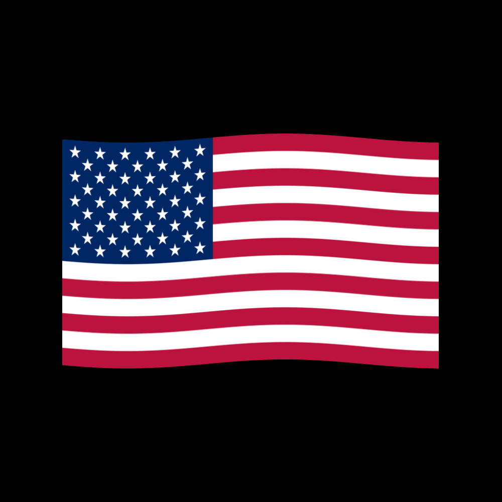

# Shader Playground

A tiny wrapper around Three.js that provides you sensible uniforms and defaults to get started with fragment shaders. Inspired by the [Book of Shaders](https://thebookofshaders.com).

## Installation

```ts
pnpm add shader-playground
```

## Usage

```ts
import { ShaderPlayground } from "shader-playground";

const playground = new ShaderPlayground({
  fragmentShader: `
    #ifdef GL_ES
    precision mediump float;
    #endif

    void main() {
      gl_FragColor = vec4(1.0, 0., 0., 1.);
    }`,
});

playground.start();

// when you're done, playground.dispose();
```

## Uniforms

- `u_time` - elapsed time
- `u_mouse` - vec2 of mouse positions relative to the container in px
- `u_resolution` - vec2 representing container dimensions in px

## Demo



To help you get started more quickly, I created a simple waving flag [demo](demo/) that shows you how to

- import glsl files with `vite-plugin-glsl`
- use custom fragment and vertex shaders
- provide your own uniforms
